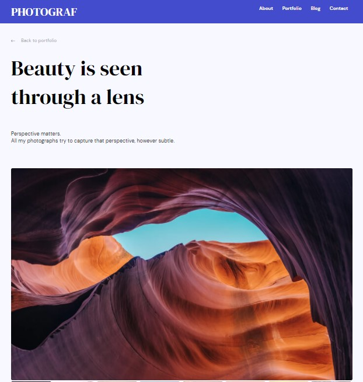

# Front end finals

## Overview



### Built With

-   [Html](https://html.com/)
-   [Css](https://w3.org/Style/CSS/Overview.en.html)
-   [Sass](https://sass-lang.com/)

## What I did

In this project, I work with html and css to create this photograf page. There is a bit of javascript for the images. Getting the right element to use is the most challenging part and also the stuctures to use. To start the website, you need to create a repository and all the files that are needed. In this project I used sass so I needed package and changed the script attribute in the package.json file for compiling scss file into css.

## How does it work

For the images, when clicking on the images, you will see the bigger version of the little image. To do that change or that replacement, I used a bit of javascript.

## How To Use

<!-- Example: -->

To clone and run this application, you'll need [Git](https://git-scm.com) and [Node.js](https://nodejs.org/en/download/) (which comes with [npm](http://npmjs.com)) installed on your computer. From your command line:

```bash
# Clone this repository
$ git clone https://github.com/your-user-name/your-project-name

# Install dependencies
$ npm install

# Run the app
$ npm start

# Run and watch scss to compile css file. This one depends on what you used in your script attribute in the package.json file.
$ npm run scss:watch
```

## Contact

-   Website [your-website.com](https://{your-web-site-link})
-   GitHub [@Mickaella](https://github.com/Mickaellah/front-end-finals)

